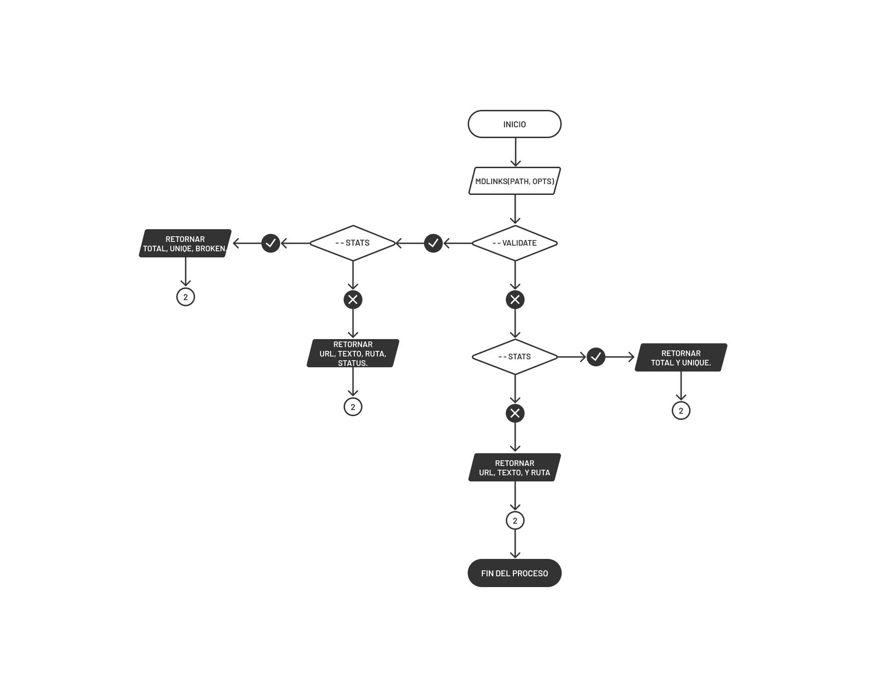

# Markdown Links

#### MDLINKS es una librería que permite leer y analizar archivos en formato markdown para verificar los links que contengan y reportar algunas estadísticas.

### Flowchart


### CLI



## Instalación
``` 
$ npm install argierdfj/LIM012-fe-md-links
```
## Uso
```js
const mdlinks = require('mdlinks');

mdLinks(path)
  .then((links) => {
    // => [{ href, text, file }]
  })
  .catch((err) => {
    console.log(err.message);
  });

mdLinks(path, { validate: true })
  .then((links) => {
    // => [{ href, text, file, status, msg }]
  })
  .catch((err) => {
    console.log(err.message);
  });
```

## CLI
```
$ npm install argierdfj/LIM012-fe-md-links
```
```
$ mdlinks ./path
  [
    {
      href: 'url',
      text: 'texto',
      file: 'ruta'
    }
  ]


$ mdlinks ./path --validate
  [
    {
      href: 'url',
      text: 'texto',
      file: 'ruta',
      status: 200,
      msg: 'OK'
    },
    {
      href: 'url',
      text: 'texto',
      file: 'ruta',
      status: 500,
      msg: 'FAIL'
    }
  ]

$ mdlinks ./path --stats
    Total: 54
    Unique: 53


$ mdlinks ./path --validate --stats
    Total: 54
    Unique: 53
    Broken: 5

```
## Licencia
MIT ©


## Objetivos de aprendizaje pendientes.

### Organización en Github

* [x] Projects
* [x] Issues
* [x] Labels
* [x] Milestones

## Objetivos de aprendizaje del proyecto.

### Javascript
- [x] Uso de callbacks
- [x] Consumo de Promesas
- [x] Creacion de Promesas
- [x] Modulos de Js
- [x] Recursión

### Node
- [x] Sistema de archivos
- [x] package.json
- [x] crear modules
- [x] Instalar y usar modules
- [x] npm scripts
- [x] CLI (Command Line Interface - Interfaz de Línea de Comando)

### Testing
- [x] Testeo de tus funciones
- [x] Testeo asíncrono
- [ ] Uso de librerias de Mock
- [ ] Mocks manuales
- [x] Testeo para multiples Sistemas Operativos

### Git y Github
- [x] Organización en Github

### Buenas prácticas de desarrollo
- [x] Modularización
- [x] Nomenclatura / Semántica
- [x] Linting

***
