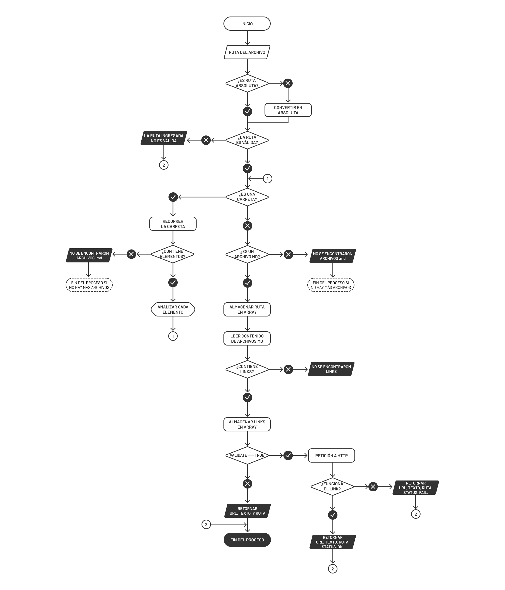

# Markdown Links



### Install
``` 
$ npm install argierdfj/LIM012-fe-md-links
```
### Usage
```js
const mdlinks = require('mdlinks');

mdlinks();
```


## Objetivos de aprendizaje

### Pendientes.

### Organización en Github

* [x] Projects
* [x] Issues
* [x] Labels
* [x] Milestones

### Del proyecto.

### Javascript
- [x] Uso de callbacks
- [x] Consumo de Promesas
- [x] Creacion de Promesas
- [x] Modulos de Js
- [x] Recursión

### Node
- [x] Sistema de archivos
- [x] package.json
- [x] crear modules
- [x] Instalar y usar modules
- [x] npm scripts
- [x] CLI (Command Line Interface - Interfaz de Línea de Comando)

### Testing
- [x] Testeo de tus funciones
- [ ] Testeo asíncrono
- [ ] Uso de librerias de Mock
- [ ] Mocks manuales
- [ ] Testeo para multiples Sistemas Operativos

### Git y Github
- [x] Organización en Github

### Buenas prácticas de desarrollo
- [x] Modularización
- [x] Nomenclatura / Semántica
- [x] Linting

***
